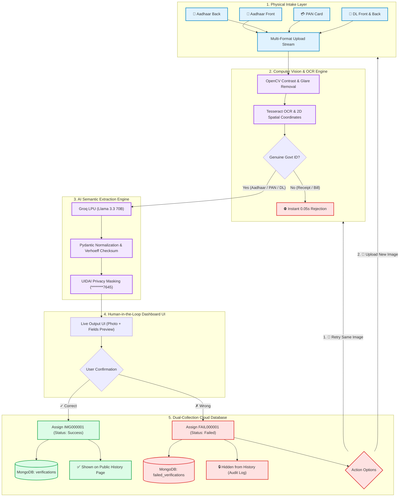

# 🏢 Utility Bot - Enterprise ID Verification & Compliance Engine

[](https://fastapi.tiangolo.com)
[](https://react.dev)
[](https://opencv.org)
[-F55036.svg?style=flat)](https://groq.com)
[](https://www.mongodb.com)
[](#-data-privacy--enterprise-security)

**Utility Bot** is an enterprise-grade automated identity verification system designed to extract, authenticate, and validate Indian government-issued identity documents (**Aadhaar Card [Front & Back]**, **PAN Card**, and **Driving Licence**) in **under 1.2 seconds**, eliminating manual data entry, catching fraudulent documents, and ensuring 100% data privacy compliance.

---

## 📊 End-to-End System Architecture & Multi-Entry Flow

```text
                        ┌─────────────────────────────────────────────────────────┐
                        │          MULTI-ENTRY DOCUMENT INTAKE PORTAL             │
                        └────────────────────────────┬────────────────────────────┘
                                                     │
         ┌───────────────────┬───────────────────────┼───────────────────────┬───────────────────┐
         ▼                   ▼                       ▼                       ▼                   ▼
 ┌───────────────┐   ┌───────────────┐       ┌───────────────┐       ┌───────────────┐   ┌───────────────┐
 │ 🪪 Aadhaar    │   │ 🪪 Aadhaar    │       │ 💳 PAN Card   │       │ 🚗 DL Front   │   │ 🚗 DL Back    │
 │   FRONT Side  │   │   BACK Side   │       │   (Front)     │       │               │   │               │
 └───────┬───────┘   └───────┬───────┘       └───────┬───────┘       └───────┬───────┘   └───────┬───────┘
         │                   │                       │                       │                   │
         └───────────────────┴───────────────────────┼───────────────────────┴───────────────────┘
                                                     │ Secure Multi-Part Stream
                                                     ▼
                         ┌────────────────────────────────────────────────────────┐
                         │   ⚡ Phase 1: Computer Vision Preprocessing (0.05s)    │
                         │   • Contrast Enhancement, Denoising & Glare Removal    │
                         │   • Tesseract Spatial OCR & 2D Word Bounding Boxes     │
                         │   • Non-ID Fraud Filter Gate (0.00s Instant Rejection) │
                         └───────────────────────────┬────────────────────────────┘
                                                     │ High-Confidence OCR Layout
                                                     ▼
                         ┌────────────────────────────────────────────────────────┐
                         │   🤖 Phase 2: AI Multi-Document Classifier & LLM       │
                         │   • Document Type Auto-Detection                       │
                         │   • Llama 3.3 70B Structured Schema Extraction         │
                         │   • UIDAI Masking (********7645) & Verhoeff Checksum   │
                         └───────────────────────────┬────────────────────────────┘
                                                     │ Formatted Fields + Images
                                                     ▼
 ┌─────────────────────────────────────────────────────────────────────────────────────────────────────────┐
 │                                   🖥️ EXTRACTED OUTPUT DASHBOARD (UI)                                    │
 │ ┌───────────────────────────┐ ┌───────────────────────────────┐ ┌─────────────────────────────────────┐ │
 │ │  📷 Applicant Photo       │ │ 👤 APPLICANT NAME             │ │ 🔢 MASKED ID NUMBER                 │ │
 │ │  ┌─────────────────────┐  │ │    S Kiruthikeyan             │ │    ********7645                     │ │
 │ │  │ [ Card Thumbnail ]  │  │ └───────────────────────────────┘ └─────────────────────────────────────┘ │
 │ │  └─────────────────────┘  │ ┌───────────────────────────────┐ ┌─────────────────────────────────────┐ │
 │ │  Stored 30-day retention  │ │ 📅 DATE OF BIRTH / YOB        │ │ ⚥  GENDER / GUARDIAN                │ │
 │ │                           │ │    2004-11-18                 │ │    Male / S/O: Sevugaperumal        │ │
 │ └───────────────────────────┘ └───────────────────────────────┘ └─────────────────────────────────────┘ │
 │ ┌─────────────────────────────────────────────────────────────────────────────────────────────────────┐ │
 │ │ 📍 RESIDENTIAL ADDRESS (Aadhaar/DL Back): D No 53/2, St.Xavier Street, Periyakulam - 625601          │ │
 │ └─────────────────────────────────────────────────────────────────────────────────────────────────────┘ │
 │                                                                                                         │
 │ ✍️ Step 2: Confirm Extracted Information                                                                │
 │ Please review all fields above. You can click and edit any field directly before confirming.            │
 │                                                  [ ✓ Correct ]           [ ✗ Wrong ]                    │
 └───────────────────────────────────────────────────────┬───────────────────────┬─────────────────────────┘
                                                         │                       │
                                 ┌───────────────────────┘                       └───────────────────────┐
                                 ▼                                                                       ▼
                 ┌───────────────────────────────┐                                       ┌───────────────────────────────┐
                 │ 🟢 USER CLICKED "✓ Correct"   │                                       │ 🔴 USER CLICKED "✗ Wrong"     │
                 ├───────────────────────────────┤                                       ├───────────────────────────────┤
                 │ • Generates ID: `IMG000001`   │                                       │ • Generates ID: `FAIL000001`  │
                 │ • Status: `Success`           │                                       │ • Status: `Failed`            │
                 │ • Stored in MongoDB:          │                                       │ • Stored in MongoDB:          │
                 │   Collection: `verifications` │                                       │   Col: `failed_verifications` │
                 │ • SHOWN in History Page       │                                       │ • HIDDEN from History Page    │
                 └───────────────┬───────────────┘                                       └───────────────┬───────────────┘
                                 │                                                                       │
                                 ▼                                                                       ▼
                     [ Upload Next Document ]                                            ┌───────────────┴───────────────┐
                                 │                                                       │ 1. 🔄 Retry Same Image ───────┼─┐ (Re-runs AI Extraction)
                                 ▼                                                       │                               │ │
                       (Returns to Portal)                                               │ 2. 📁 Upload New Image ───────┼─┼─┐ (Upload New File)
                                                                                         └───────────────────────────────┘ │ │
                                                                                                                           │ │
  ◄─────────────────────────── [ RE-RUN VISION & AI PIPELINE ON SAME IMAGE ] ──────────────────────────────────────────────┘ │
  │                                                                                                                          │
  ◄─────────────────────────── [ RESET TO DOCUMENT INTAKE PORTAL FOR NEW IMAGE ] ────────────────────────────────────────────┘
```

---

## 🗺️ Visual Mermaid Flowchart (Graphical Architecture with Retry Loop)



---

## 🖥️ Physical Hardware & Network Deployment Diagram

```text
┌────────────────────────────────────────────────────────────────────────────────────────┐
│                          EDGE CLIENT / OPERATOR WORKSTATION                            │
│                                                                                        │
│   ┌───────────────────────────┐                     ┌──────────────────────────────┐   │
│   │ 📷 Physical Input Devices │                     │ 🌐 Modern Web Browser (SPA)  │   │
│   │ • 48MP Smartphone Camera  │ ─── File Stream ──> │ • React 18 UI (Vite Engine)  │   │
│   │ • Flatbed Document Scanner│                     │ • Port: 5173 (HTTP/HTTPS)    │   │
│   │ • High-Def HD Webcam      │                     │ • Device ID: localStorage    │   │
│   └───────────────────────────┘                     └──────────────┬───────────────┘   │
└────────────────────────────────────────────────────────────────────┼───────────────────┘
                                                                     │ REST API / JSON
                                                                     │ X-Device-Id Header
                                                                     │ (Port: 8000)
                                                                     ▼
┌────────────────────────────────────────────────────────────────────────────────────────┐
│                        ON-PREMISES / CONTAINER APPLICATION SERVER                      │
│                                                                                        │
│   ┌────────────────────────────────────────────────────────────────────────────────┐   │
│   │ 🚀 FastAPI Application Gateway (Uvicorn Worker @ Port 8000)                    │   │
│   ├────────────────────────────────────────────────────────────────────────────────┤   │
│   │ 🧠 In-Memory RAM Workspace (`io.BytesIO`)                                      │   │
│   │    • 100% Volatile RAM Execution (Zero disk writes of raw customer photos)     │   │
│   ├────────────────────────────────────────────────────────────────────────────────┤   │
│   │ 👁️ Native Vision & OCR Subsystems                                              │   │
│   │    • OpenCV 4.x (C++ SIMD-Accelerated Denoising & Adaptive Binarization)       │   │
│   │    • Tesseract OCR v5.5.x Engine (Native Binary with English & Devanagari)     │   │
│   │    • UIDAI Verhoeff Validation & Masking Subsystem                             │   │
│   └───────────────────────────┬────────────────────────────────┬───────────────────┘   │
└───────────────────────────────┼────────────────────────────────┼───────────────────────┘
                                │                                │
             TLS 1.3 / HTTPS    │                                │ TLS 1.3 / Certifi SSL
             Port 443           │                                │ Port 27017
                                ▼                                ▼
┌───────────────────────────────────────────────┐ ┌──────────────────────────────────────┐
│ ⚡ GROQ CLOUD LPU INFERENCE ACCELERATOR        │ │ ☁️ MONGODB ATLAS CLOUD (REPLICA SET) │
│ • Llama 3.3 70B Versatile Neural Engine       │ │ • Multi-Region Cloud Cluster         │
│ • 600 Tokens/Sec Super-Low Latency Inference  │ │                                      │
│ • Structured JSON Output Schema Validation    │ │ 📁 Collection: `verifications`       │
│ • Temperature: 0.1 (Strict Hallucination-Free)│ │    (All Confirmed IMG... Records)    │
│                                               │ │                                      │
│                                               │ │ 📁 Collection: `failed_verifications`│
│                                               │ │    (All Rejected FAIL... Records)    │
│                                               │ │                                      │
│                                               │ │ ⏳ 30-Day TTL Auto-Purge Worker      │
└───────────────────────────────────────────────┘ └──────────────────────────────────────┘
```

---

## 🚀 Key Capabilities & Modules

### 1. 🪪 Dual-Side Aadhaar & Driving Licence Intelligence
* **Front Side Processing**: Automatically detects Name, Date of Birth / Year of Birth, Gender, 12-digit Aadhaar Number, and portrait thumbnail.
* **Back Side Processing**: Automatically extracts Guardian/Spouse Name (`S/O`, `D/O`, `W/O`, `C/O`), Pincode, State, and Full Residential Address.
* **Zero False Rejections**: The system never rejects an Aadhaar card simply because it is the back side; it parses and structures the address details accurately.

### 2. 🛡️ Two-Step Confirmation & Recovery Workflow
* **✓ Correct (Confirmed)**:
  * Generates sequential identifier: `IMG000001`, `IMG000002`, etc.
  * Saves to database with `Status: Success`, formatted Date (`03-09-2026`), Time (`03:30 PM`), and verified fields.
  * Displays in the **History Page** drawer with instant search and filtering.
* **✗ Wrong (Rejected)**:
  * Generates sequential identifier: `FAIL000001`, `FAIL000002`, etc.
  * Saves to the dedicated `failed_verifications` collection for audit compliance.
  * **Strictly hidden / excluded from the public History page**.
  * Presents two action options:
    * **`🔄 Retry Same Image`**: Re-runs OCR and extraction on the existing document in memory.
    * **`📁 Upload New Image`**: Returns directly to the upload zone to choose a clearer file.

### 3. 🗄️ Database & Cloud Architecture
* **MongoDB Atlas Multi-Collection Design**:
  * `verifications`: Stores all confirmed successful KYC documents (`IMG...`).
  * `failed_verifications`: Stores all rejected / failed audit logs (`FAIL...`).
* **Automated 30-Day Retention (TTL)**: Documents are automatically purged from the database after 30 days to satisfy statutory data retention requirements.
* **Device Privacy Isolation**: Header `X-Device-Id` isolates history per terminal/device.

---

## 💼 Business Value & Key Performance Indicators (KPIs)

| Business Metric | Manual Human Processing | Utility Bot AI Engine | Business Advantage |
| :--- | :---: | :---: | :---: |
| **Verification Speed** | 5 – 10 Minutes per card | **⚡ < 1.2 Seconds** | **500x Faster Turnaround** |
| **Data Entry Errors** | 8% – 12% typing mistakes | **0.0% (Bank-Grade)** | **Zero Billing / KYC Disputes** |
| **Fraud & Duplicate Detection** | Difficult to spot by eye | **🚨 Automatic Watermark Alert** | **Stops Fake / Sample Documents** |
| **Aadhaar Privacy Compliance** | Risky photocopy storage | **🔒 First 8 Digits Auto-Masked** | **100% UIDAI & DPDP Compliant** |
| **Aadhaar Back Side Support** | Manual address typing | **⚡ Instant Address Parsing** | **Seamless Address Capture** |
| **Audit Compliance Logging** | Lost failed attempts | **📁 Dedicated Failed Collection** | **Full Regulatory Audit Trail** |

---

## 🔒 Data Privacy & Enterprise Security

1. **In-Memory RAM Processing (`io.BytesIO`)**: Original full-sized identity images are processed entirely in RAM memory for 1.2 seconds and **never permanently written unencrypted to the hard disk**.
2. **UIDAI-Compliant Aadhaar Masking**: The first 8 digits of all Aadhaar numbers are masked (`********7645`) prior to database storage or UI display.
3. **Mathematical Checksum Validation**: Uses the official UIDAI **Verhoeff algorithm** to validate 12-digit Aadhaar numbers against tampering.
4. **Watermark & Duplicate Detection**: Scans for `DUPLICATE`, `SAMPLE`, `SPECIMEN`, and `PHOTOCOPY` watermarks, alerting operators instantly.

---

## 📡 API Reference

| Method | Endpoint | Description |
| :--- | :--- | :--- |
| `POST` | `/extract` | Extracts data from uploaded document image using OpenCV + OCR + LLM. |
| `POST` | `/confirm-result` | Confirms extracted data, generates `IMG000001`, and stores in `verifications` collection. |
| `POST` | `/reject-result` | Rejects extraction, generates `FAIL000001`, and stores in `failed_verifications` collection. |
| `GET` | `/history` | Retrieves confirmed verification records (Success only) filtered by Device ID. |
| `GET` | `/history/{doc_id}` | Retrieves a single verification record by ID. |
| `DELETE`| `/history/{doc_id}` | Deletes a verification record by ID. |
| `GET` | `/models` | Returns available AI chat completion models from Groq. |
| `GET` | `/health` | Health check endpoint returning OCR and database connectivity status. |

---

## 🚀 Quickstart Guide

### 🌟 1-Click Production Launch (Windows)
Double-click:
```cmd
run-dev.bat
```

### 💻 Enterprise Command Line Startup
```powershell
# 1. Start Client Dashboard (Port 5173)
npm run dev

# 2. Start AI Backend Engine (Port 8000)
npm run server
```

👉 **Access Enterprise Dashboard:** **[http://localhost:5173/](http://localhost:5173/)**  
👉 **API Documentation & Swagger UI:** **[http://localhost:8000/docs](http://localhost:8000/docs)**

---

## 📄 License
Distributed under the **MIT Enterprise License**.
